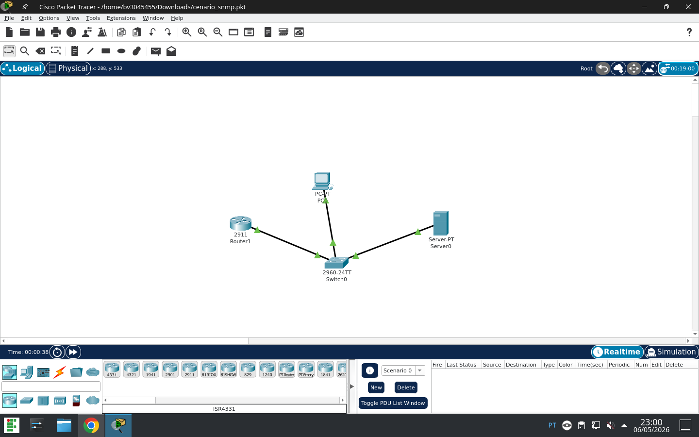

# 🧪Atividade SNMP — Administração de Redes de Computadores (ARC)

## 📌 Objetivo

O objetivo deste laboratório foi configurar e testar o protocolo SNMP no Cisco Packet Tracer, permitindo o monitoramento de dispositivos de rede através do servidor NMS utilizando o MIB Browser.

---

# 🖥️ 1. Topologia da Rede

Abaixo está a topologia utilizada no laboratório:

  

---

# 📡 2. Resultados Obtidos

## 🔍 Valores retornados pelo SNMP

### sysDescr and sysLocation
```text
Cisco IOS Software, C2900 Software (C2900-UNIVERSALK9-M), Version 15.x

```text
Laboratorio_Redes_IFSP
```

## 📌 Observação

Ao adicionar o segundo switch não consegui, continuar o desafio pois estava dando erro.

## Reflexão
Em redes reais evitamos utilizar a community string `public` porque ela é conhecida e não possui criptografia, permitindo o acesso fácil às informações dos dispositivos. 

O SNMPv3 é mais seguro porque adiciona autenticação, criptografia e controle de acesso, protegendo os dados trafegados na rede.

* Referencias:
- Material da disciplina ARC
Cisco Packet Tracer
IA ChatGPT ( Ferramenta de auxilio).